#### 如何设计微服务以及设计原则

​	1.AKF拆分原则

​	2.前后端分离原则

​	3.无状态服务

​	4.RestFul的通信风格

1.AKF拆分原则

​	AKF扩展立方

​	Y轴：关注应用中功能划分，基于不同的业务拆分                功能拆分

​	X轴：关注水平扩展，也就是加机器解决问题			水平克隆

​	Z轴：关注服务和数据的优先级划分，如按地域划分	  数据拆分

2.无状态：

​	如果一个数据需要被多个服务共享，才能完成一笔交易，那么这个数据就称为状态，进而依赖这个“状态”数据的服务称为有状态服务，反之为无状态服务。

​	这个无状态服务原则并不是说在微服务架构里就不允许存在状态，表达的真实意思是要把有状态的业务服务改变为无状态的计算类服务，那么状态数据也就相应的迁移到对应的“有状态服务”中

#### 马丁福勒微服务讲解：

​	一组小的服务、独立的进程、轻量级通信、基于业务能力、独立部署、无集中式管理

SOA服务?

#### 利弊：

​	利：强模块化边界、可独立部署、技术多样性

​	弊: 分布式复杂性、最终一致性、运维复杂性、测试复杂性

微服务组织架构&技术架构

#### 一个清晰简洁的服务分层:微服务组织架构

​	

#### 技术架构

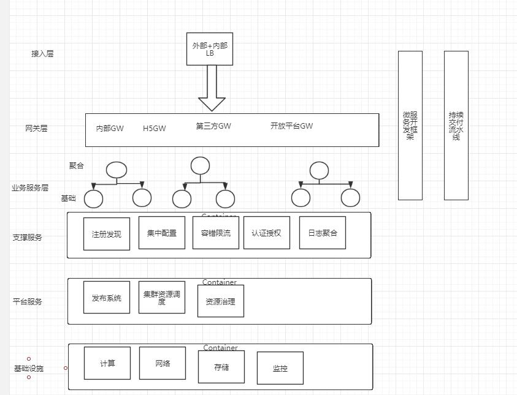

##### 微服务三种服务发现机制：

​	一、服务发现：服务的消费方(Consumer)如何发现服务的提供方(Provider)？

​	二、负载均衡：服务的消费方如何以某种负载均衡策略访问集群中的服务提供方实例？

ServiceMesh(服务网格逐渐兴起)

##### 1.传统集中式代理

​	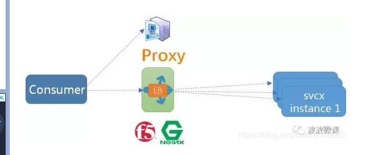

在服务消费者和生产者之间，代理作为独立一层集中部署，由独立团队(一般是运维或框架)负责治理和运维集中式代理有硬件负载均衡器(如F5)，或者软件负载均衡器(如Nginx)，F5(4层负载)+Nginx(7层负载)这种软硬结合两层代理也是业内常见做法

种方式通常在DNS域名服务器的配合下实现服务发现，服务注册(建立服务域名和IP地址之间的映射关系)一般由运维人员在代理上手工配置，服务消费方仅依赖服务域名，这个域名指向代理，由代理解析目标地址并做负载均衡和调用。

##### 客户端切入式代理

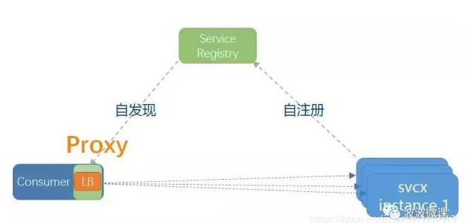

代理(包括服务发现和负载均衡逻辑)以客户库的形式嵌入在应用程序中。这种模式一般需要独立的服务注册中心组件配合，服务启动时自动注册到注册中心并定期报心跳，客户端代理则发现服务并做负载均衡

Netflix开源的Eureka(注册中心)[附录1]和Ribbon(客户端代理)[附录2]是这种模式的典型案例，国内阿里开源的Dubbo也是采用这种模式。

##### 主机独立进程代理

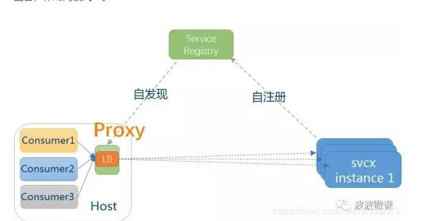

代理既不是独立集中部署，也不嵌入在客户应用程序中，而是作为独立进程部署在每一个主机上，一个主机上的多个消费者应用可以共用这个代理，实现服务发现和负载均衡，如下图所示。这个模式一般也需要独立的服务注册中心组件配合，作用同模式二。

#### API服务网关

​	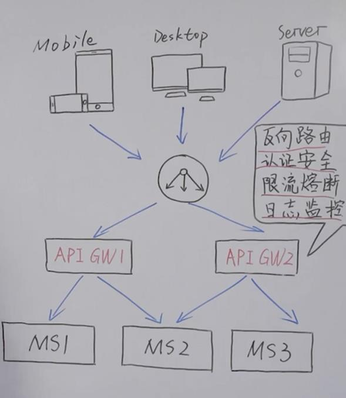

##### Zuul网关主要结构

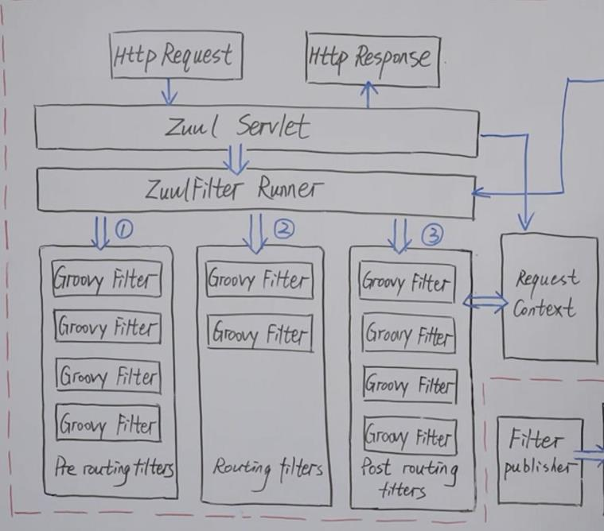

运行流程

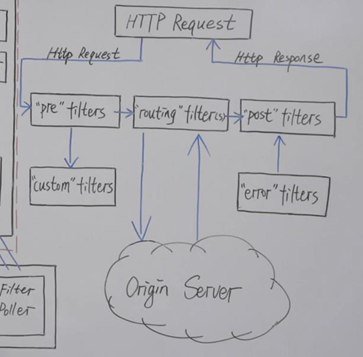

#### Netflix服务路由体系

Eureka服务注册中心,Zuul网关服务

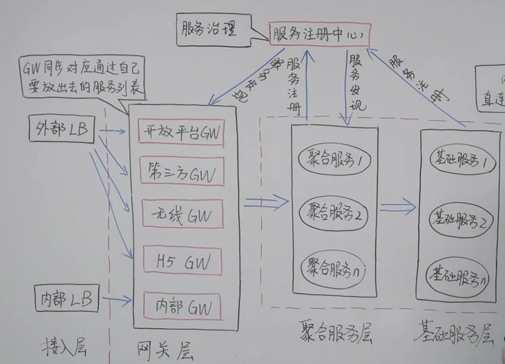

#### 集中式配置中心

​	Apollo

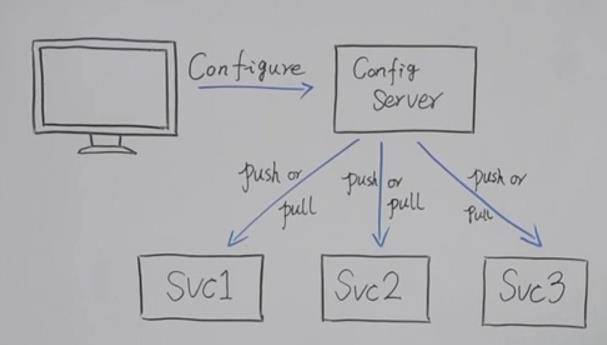

#### 通讯方式对比

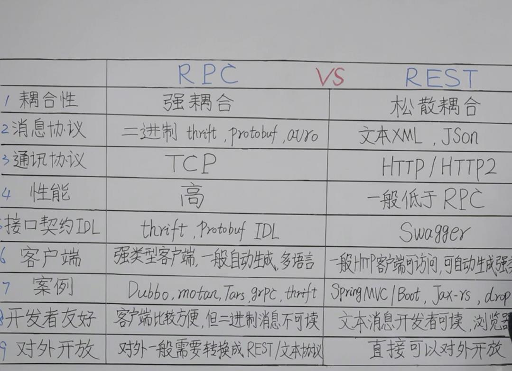

#### 调用链监控

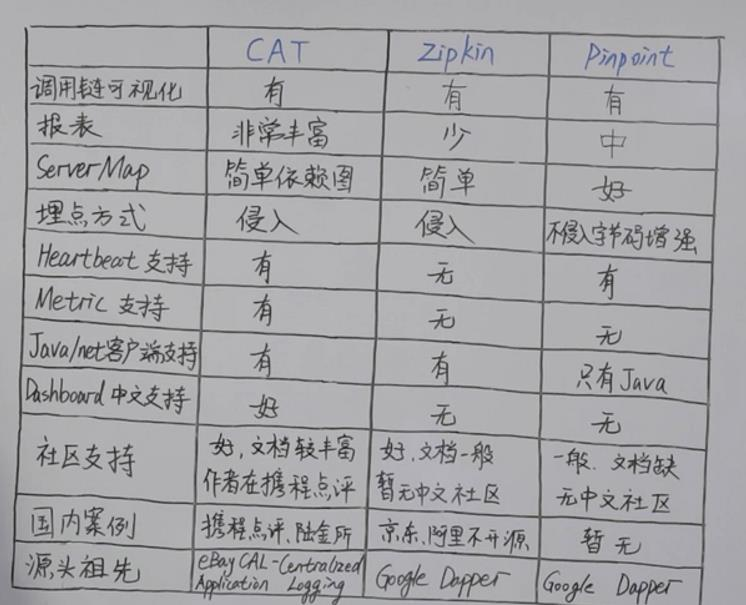

### Cloud技术升级&选型

​	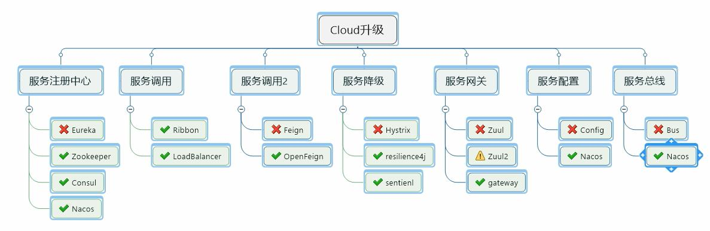

### 服务以注册于发现

​	Eureka

​	Zookepper

​	consul

### 服务调用

​	Feign和OpenFeign

Feigin是一个轻量级的RESTful的Http服务客户端，Feign内置了Ribbon，使用客户端负载均衡，去调用服务注册中心的服务，

OpenFeign是在Fegin的基础上支持了SpringMvc的注解

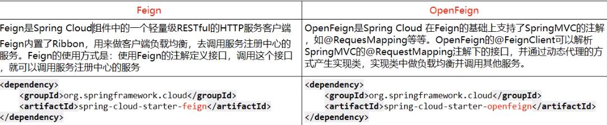

### 服务降级

 Hystrix

<https://blog.csdn.net/tongtong_use/article/details/78611225>

ystrix也是Netflix套件的一部分。他的功能是，当对某个服务的调用在一定的时间内（默认10s），有超过一定次数（默认20次）并且失败率超过一定值（默认50%），该服务的断路器会打开。返回一个由开发者设定的fallback。

fallback可以是另一个由Hystrix保护的服务调用，也可以是固定的值。fallback也可以设计成链式调用，先执行某些逻辑，再返回fallback。

#### 重要概念

##### 	服务降级fallback

​		不让客户端等待并立即返回，fallback；程序运行异常，超时，服务熔断触发服务降级，线程池/信号量打满等出现降级

##### 	服务熔断back

​		达到最大服务访问后，直接拒绝访问，然后调用服务降级

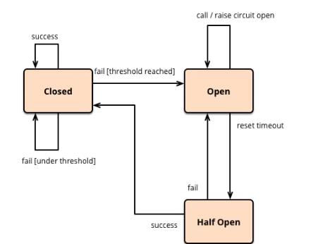

##### 	服务限流limitflow

​		秒杀高并发，一秒N个，有序进行

Kubernetes服务编排

微服务：独立的进程，轻量的通讯，自动化部署

特征：单一职责，轻量级通讯，隔离性

what&when今天要分享的主题，通过简短介绍吸引听众

why:为什么要做这个架构改造，技术升级

How:深入浅出3-4个最核心的内容点

Future:让大家了解你的未来计划，你对技术趋势的看法

对今天的主题在做一个回顾，让听众加深对核心内容记忆

#### Gateway新一代网关

​	路由转发+执行过滤链

​	SpringCloudGateway

​	基于WebFlux框架实现，底层使用了高性能的Reactor模式通信框架Netty

​	WebFlux

##### 三个核心概念：<https://blog.csdn.net/qq_41211642>

Route(路由)、Predicate(断言)、Filter(过滤)

Route:构建网关的基本模块，它由ID、目标URI、一系列的断言和过滤组成，如果断言为true则匹配该路由

Predicate:参考Java8的Predicate,匹配HTTP请求中的所有内容

Filter:可以在请求被路由之前或者之后对请求进行修改